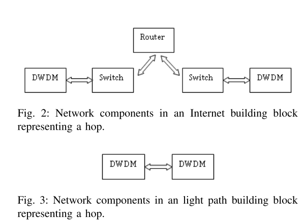
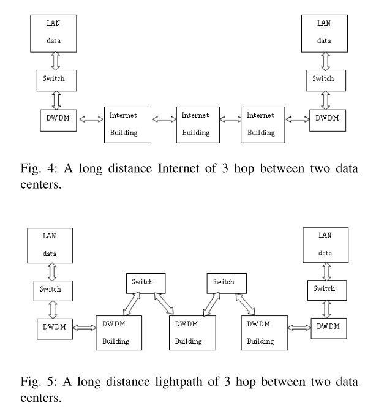
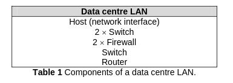

## CPE & AN

Formula from [Coroama2015](https://link.springer.com/chapter/10.1007/978-3-319-09228-7_8):

$$
E_{CPE,AN} = t_s I_{CPE,AN} = t_s(R_{idle} \frac{P_{CPE}}{N_{CPE}} + \frac{P_{AN}}{N_{AN}} PUE_{AN})
$$

- $E_{CPE,AN}$: Energy consumption of both CPE and AN.
- $t_s$: time of service consumption.
- $I_{CPE,AN}$: Intensity of both CPE and AN.
- $R_{idle}$: Ratio of time that the device is actively working. 
- $P_{CPE}$: Power of all CPE devices.
- $N_{CPE}$: Number of Users connected to the CPE.
- $P_{AN}$: Power of all AN devices.
- $N_{AN}$: Number of users (subscribers) connected to the AN
- $PUE_{AN}$: PUE of the AN.

This method is time sensitive.

According to the paper:
- $R_{idle} = \frac{t_{on}}{t_{use}}$.
- $R_{idle} = 6$ from the technical report [Fraunhofer IZM](https://www.izm.fraunhofer.de/content/dam/izm/en/documents/Publikationen/Jahresberichte/AR_2008_EN_web.pdf).
- $P_{CPE} = 8W$, using data from [ENERGY STAR, Nov 2013](https://www.energystar.gov/sites/default/files/specs/SmallNetworkEquipment_V1_ENERGYSTAR_ProgramRequirements_Nov2013_0.pdf) and doing some rounding up to account for legacy equipment.
- They assume $N_{CPE} = 1$, because they are modeling the energy intensity of the Internet, that is the average value for one Internet connection.
- $\frac{P_{AN}}{N_{AN}} = 2W$, from the study [Schien2013](https://onlinelibrary.wiley.com/doi/full/10.1111/jiec.12065).
- $PUE = 2$
- Finally, $I_{CPE\&AN} = 52W$

We can write $P_{CPE}$ in two ways:

- $\sum{P_i}$: this is impratical because the user will probably use the same type of router or similar routers in the network. And if they are different  it is annoying to calculate the sum for all the network.
- $N_{router}P_{router}$: this is not as accurate but should be a close enough alternative.

(idea) Using the second way, the $t_s$ could be influenced by the $N_{CPE}$ and $N_{routers}$  

## Edge and Core

- It is dependent on data volume.
- According to [Schien2015](https://www.researchgate.net/publication/266968255_The_Energy_Intensity_of_the_Internet_Edge_and_Core_Networks)
the consumption is 0.052 kWh/GB.
- The value above is also used by [Manz2022](https://onlinelibrary.wiley.com/doi/10.1111/j.1530-9290.2010.00278.x)
- This layer the user probably won't have a way to change it because it is related to the ISP so we can use a value from a study like [Schien2015](https://www.researchgate.net/publication/266968255_The_Energy_Intensity_of_the_Internet_Edge_and_Core_Networks)
- [Malmodin 2010](https://www.ericsson.com/en/reports-and-papers/research-papers/lca-of-data-transmission-and-ip-core-networks) estimates that the value of the core network for Sweden is 0.08 kwh/GB

From [Taal2014](https://ieeexplore.ieee.org/document/6866547) they assue two paths that data can take, via public internet or a dedicated network called lightpath.

Both paths model somewhat the core network that as been mention before.
The paper also has into account the energy of the network of the data center, which we don't take into account in this boundary.

The network model is the following:

$$
    E_{LAN\_DC}(D_{in}) = \frac{PUE_{DC}}{U} \cdot \frac{8D{in}}{3600} \cdot \bigg( \frac{P_{serv}}{C_{serv}} \cdot \frac{3P_{switch}}{C_{switch}} \cdot \frac{P_{router}}{C_{router}} \bigg)
$$
$$
    E_{internet}(D_{in}) = \frac{PUE_{DC}}{U} \cdot \frac{8D{in}}{3600} \cdot \Bigg( \bigg( \frac{2P_{switch}}{C_{switch}} + \frac{2P_{DWDM}}{C_{DWDM}} \bigg) + \bigg(\frac{2P_{switch}}{C_{switch}} + \frac{2P_{DWDM}}{C_{DWDM}} + \frac{P_{router}}{C_{router}}\bigg) \cdot n_{hops} \Bigg)
$$
$$
    E_{lightpath}(D_{in}) = \frac{PUE_{DC}}{U} \cdot \frac{8D{in}}{3600} \cdot \Bigg( \bigg( \frac{2P_{switch}}{C_{switch}} + \frac{2P_{DWDM}}{C_{DWDM}} \bigg) + \bigg(\frac{2P_{DWDM}}{C_{DWDM}}\bigg) \cdot n_{hops} + \bigg( \frac{P_{switch}}{C_{switch}} \bigg) \cdot \bigg( n_{hops} - 1 \bigg) \Bigg)
$$

The structure LAN of the datacenter is based on this table: 

This structure only considers DWDM terminal nodes, it ignores optical line amplifiers, regenerators, and optical switches such as OXCs which the paper by [Schien2015](https://www.researchgate.net/publication/266968255_The_Energy_Intensity_of_the_Internet_Edge_and_Core_Networks) mentions.

## Datacenter (DC)

The cost of the datacenter will only be the storage cost, as server activity isn't relevant for this study.

The model we create should be a compromised between complexety and simplicity. The most simple model would be:
$$
E(V, t) = V*t*P_{GB}
$$
- $E$: energy consumption.
- $V$: data volume.
- $t$: time for the task.
- $P_{GP}$: Power per gigabyte

$P_{GB}$ would be the average or a value that the user could input. But I don't think that the user would have apriori the value for $P_{GB}$ of his  system.

The model should also be too complexed has presented in the paper [Miriam 2009](https://www.researchgate.net/publication/221351970_Storage_modeling_for_power_estimation).
This model is based on a set of disk activities, such as the average number of seeks/sec, average number of transferred bytes/sec or the disk queue length. 

According to [Li Y](https://ieeexplore.ieee.org/stamp/stamp.jsp?tp=&arnumber=7033642) the power consumption of storage devices (HDD, SDD) is dependent of what type of I/O workload being used.
The paper describes 2 types of workloads:
- capability 
- capacity

Capbility workloads are when its demand for I/O bandwidth is more difficult to meet than its demand for storage space. For example a web server.
Capacity is when the requirement for storage space is greater than other requirements.

If we take the SRA example the type of workload we will deal with is capacity, due to the sheer amount of data.

The formula for calculating the energy consumption of the I/O operation:

$$
    E = T_a P_i N_i + T_a P_b N_a
$$

- E: Energy consumption of the workload.
- T_a: The time needed to complete the workload.
- P_i: The Power of the device when in idle mode.
- P_b: The Power of the device when in busy mode.
- N_i: The number of idle devices during the workload.
- N_a: The number of active devices during the workload.

The $T_a$ can be expressed as:

$$
    T_a = \frac{W_c}{W_{ab}}
$$

- $W_c$: Workload capacity requirement.
- $W_{ab}$: Workload average bandwith requirement.

The number of active and idle devices ($N_a$, $N_i$) can be expressed as: 

$$
    N = \left \lceil {\frac{W_c}{D_c}} \right \rceil
$$
$$
    N_a = \alpha \frac{W_{ab}}{D_b}
$$
$$
    N_i = N - N_a
$$

- $N$: Total number of devices used in the workload.
- $W_c$: Workload capacity requirement.
- $W_{ab}$: Workload average bandwith requirement.
- $D_c$: Device capacity.
- $D_b$: Device bandwith.
- $\alpha$: if $N_{min}$ is the theoretical minimum number of devices needed to complete the workload then, $\alpha N_{min}$ is the actual number of devices needed, $\alpha \in [1,\frac{N}{N_{min}}]$.

This approach doesn't take into account the operational costs and cooling costs, a simple solution would be multiplying the result by a constant, $PUE_{dc}$.

According to the [US DC Report 2016](https://www.osti.gov/biblio/1372902/) a more "simplified" way to calculate energy:

$$
E_y = \sum_{t=HDD,SDD}{(I_{t,y} * P_{t,y}) * h_y * (1 + O * \frac{C_{external}}{C_{total}})}
$$

- $E_y$: Storage electricity consumption in year y
- $I_{t,y}$: Installed base of storage type t in year y
- $P_{t,y}$: Per-unit power consumption of storage type t in year y
- $h_y$: Number of hours in year y
- $O$: Operational energy as a fraction of storage energy
- $C_{external}$: Capacity of the external storage installed base
- $C_{total}$: Capacity of the total storage installed base

For our use case instead of year it would be the time to process the workload.

The second part of the equation $(1 + O * \frac{C_{external}}{C_{total}})$ refers to the operational cost of storage that is external to the server.
The report states that operational cost is assumed to be 25% of the storage energy, based on industry comment, and it only applies to external storage. 

(opinion) I would assume that in our use case, $C_{external} \simeq C_{total}$, because it makes sense to have large external storage when dealing with a great amount data. So $\frac{C_{external}}{C_{total}} \simeq 1$

From [Taal2014](https://ieeexplore.ieee.org/document/6866547) the cost of storage has in account 3 factors: $E_{write}$, $E_{read}$, $E_{store}$. They assume that the storage architecture comprises of a SAN that consists of a content server, ethernet switch and content server. 

$$
    E_{write}(D_{in}) = \frac{PUE}{U} \cdot \frac{8D_{in}}{3600} \cdot \bigg(\frac{P_{server}}{C_{server}} + \frac{P_{sw}}{C_{sw}} + N_d(D_{in}) \frac{P_{disk}}{C_{disk}}  \bigg) 
$$

- $PUE$: datacenter effiiency.
- $U$: accounts for the utilization of the data equipment, expressing the fact data equipment typically does not operate at a full utilization while still consuming 100% of the power, $U = 0.5$
- $\frac{8D_{in}}{3600}$: covert Gbps to GBph
- $P_x$: power consumption in kW of server, switch and disk.
- $C_x$: capacity of the components
- $N_d(D_{in})$: number of disks used for capacity $D_{in}$ 

$$
    N_d(D_{in}) = 2 \cdot \bigg \lceil \frac{D_{in}}{S_{array} \cdot S_{disk}} \bigg \rceil
$$

- $S_{array}$: Number of disks in the array
- $S_{disk}$: Capacity of disks (GB)

$$
    E_{store}(D_{in}, RT) = \frac{PUE}{U} \cdot N_d(D_{in}) \cdot P_{disk} \cdot RT
$$

- $RT$: retenton time of the data stored

$$
    E_{read}(D_{out}) = \frac{PUE}{U} \cdot \frac{8D_{out}}{3600} \cdot \bigg(\frac{P_{server}}{C_{server}} + \frac{P_{sw}}{C_{sw}}  \bigg)
$$

- $D_{out}$: Data being read.

This model uses $D_{in}$ for the amount of data that is being written and stored. I think there should be a seperation of data written and storage because not every write is a POST, some can be PUT, so $D_{in}$ should become $D_{write}$, $D_{store}$, amount of data written and stored.

In the example of the article they model for a $PUE=1.2$, $D_{in} = 2000$ GB, $RT =$ 1 week = 168h, and a download rate of 500 GB/h so $D_{out} = 500*RT$. The architecture is RAID 10 with 12 disks of 1 tera. However the value shown doesn't make sense with the configuration discribed, because using the formula for the $N_d$ above, we would get $N_d = 2$ resulting in $E_{total} = 151.2$, but assuming that $N_d = 12$ (full use of the disks), $E_{total} = 212.192$, so either the formula given is wrong or they made an error in calculating the energy value. I think that the formula is wrong because if we have 12 teras of storage $N_d$ would be 2 instead of the 12*2=24 (full set of disk plus redundancy).
So the correct formula should be:

$$
    N_d(D_{in}) = 2 \cdot \bigg\lceil \frac{D_{in}}{S_{disk}} \bigg\rceil
$$

## PUE

The measure most commonly used to rate the energy efficiency of data centres is the power usage effectiveness
(PUE). The PUE is expressed as the ratio of the total power consumption of a data centre (PIN) to the total power consumption of IT equipment such as storage devices, servers and routers (PIT).ܷܲ 

$$
    PUE = \frac{P_{IN}}{P_{IT}} = CLF + PLF + 1 \\ 1 < PUE < \infty
$$

In calculating their PUE, data centres use two terms: CLF and PLF. CLF represents the cooling load factor normalized to the IT load (losses associated with chillers, pumps, air conditioners) and PLF represents the power load factor normalized to IT load (losses associated with switchgear, UPS, PDU) [Taal2013](https://pure.uva.nl/ws/files/1520801/166927_Transporting_Bits_or_Transporting_Energy_does_it_matter_May2013.pdf).

According to the datacenter survey from [Uptime Institute 2022](https://uptimeinstitute.com/resources/research-and-reports/uptime-institute-global-data-center-survey-results-2022) who has been tracking the PUE since 2007, the value has seen little improvement since 2014, arriving at the average value of 1.55 in 2022.

According to [US DC Report 2016](https://www.osti.gov/biblio/1372902/) the $PUE_{dc}$ varies by the space type of the DC.

|Type|PUE|
|---|---|
|Closet| 2.0|
|Room| 2.5|
|Localized|2.0|
|Midtier|1.9|
|High-end|1.7|
|Hyperscale|1.2|

